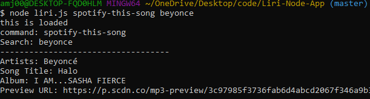

# LiriBot

What is "LiriBot"?

LiriBot is an application that allows a user to insert a request through a computer terminal, by using actions to request information, using different NPM packages(axios, dotenv, moment, and node-spotify-api) that retrieves data from API's with the assistance of nodeJS.

This application is a fun way and easy way to search some of your favorite artists, their upcoming concerts, and movies. It will provide you some general information with each search. The search results vary depending on which action search you decide on. The three API's you are able to search are spotify, bandsintown, and OMDB. These are popular applications that most people are familiar with. 

Technical Info:

The NPM packages must be installed on the terminal before the application can run properly. The packages will load onto the package.json file under an object labeled dependencies. In addition, to have access to developmentAPI's you will need to access API keys that you can store on a seprate file within the folder of which your application is stored. Then you will need to require each of the npm packages on the files so they can brought to the browser.

User Capabilites: 

This application runs based off of a user's input. The user's input consists of "node, the document file name, the action it wants the terminal to run, and the search term for that specific action. 

The insert of "node" is indicating that we are using nodeJS. The document file name is where the actual javascript code is written for the applcation. There are three different "actions" the user can choose from to show results from 3 API's including,Spotify, OMDB, & BandsInTown. The three different actions set for this application are spotify-this-song, movie-this,concert-this. These actions will trigger which API to read from. Depending on which action the user chooses will dictate what the search term will be. 

For example, if I wanted to search Beyonce using the spotify-this-song action I would insert...(See Below)
"node liri.js spotify-this-song beyonce"

Technologies Used: 
-nodeJS
-javascript
-API requests

Author + Contributor: 
Aliesa Jackson

